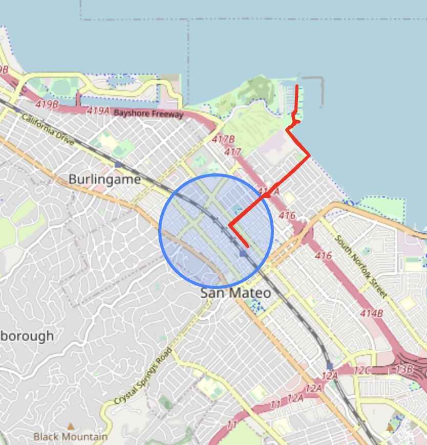
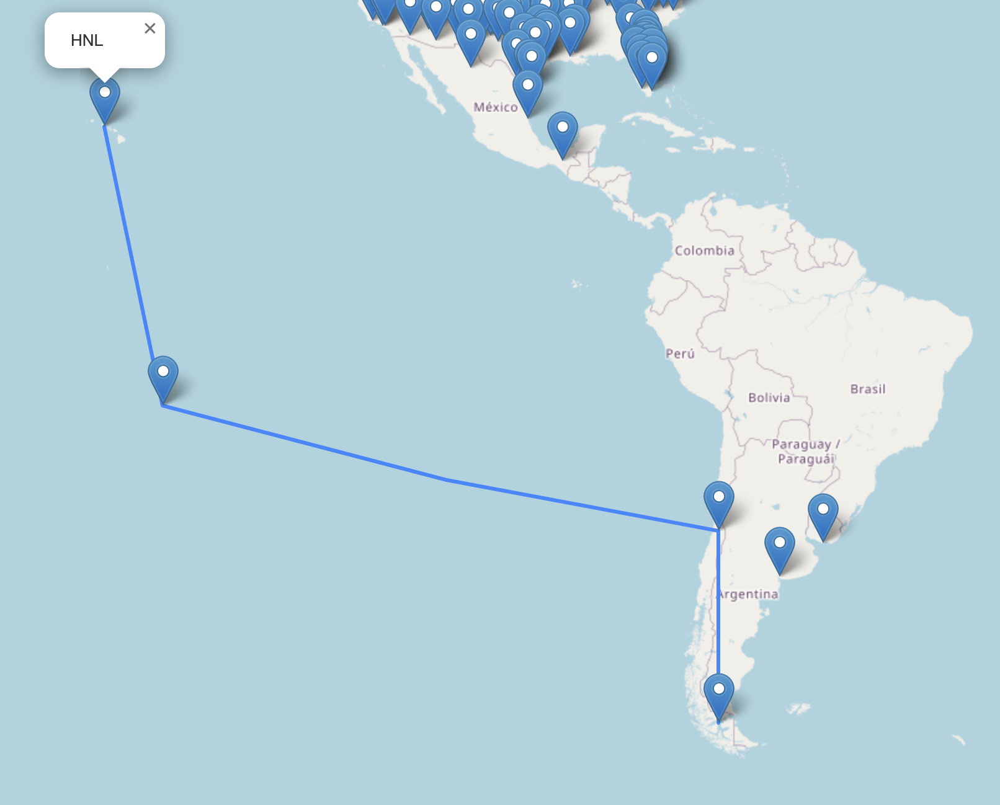

# Geospatial Graph Demos

Map-based demos to showcase geospatial functionality in Neo4j.

## Spatial Search With Neo4j

These examples use points of interest from the Daylight Earth Table OpenStreetMap distribution. [This Python notebook](https://github.com/johnymontana/daylight-earth-graph/blob/main/POI_import.ipynb) has the code to import this data into Neo4j.

### Radius Distance Search

### Bounding Box Search

### Point In Polygon Search

### Line Geometry Search

## Routing

