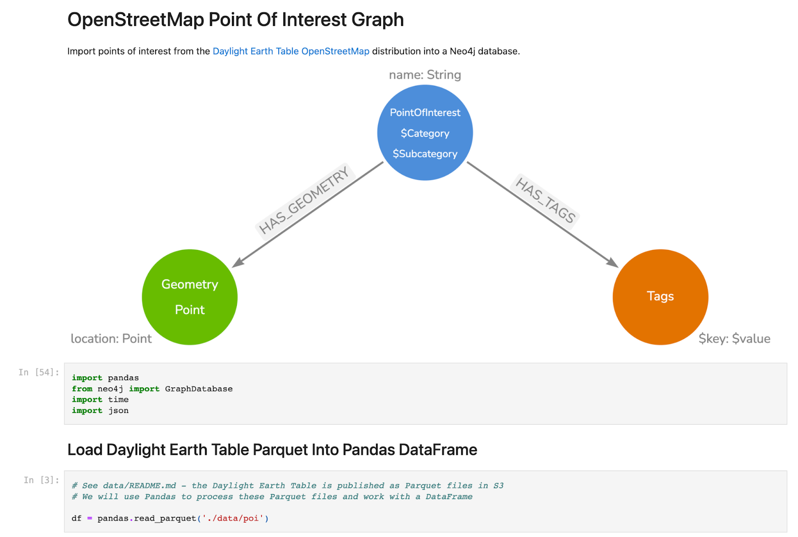
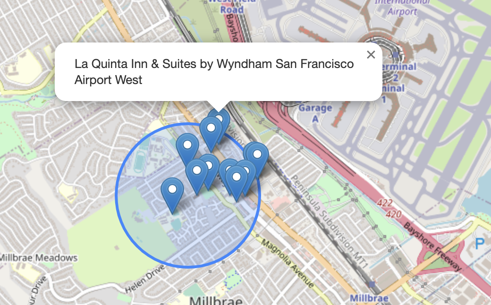
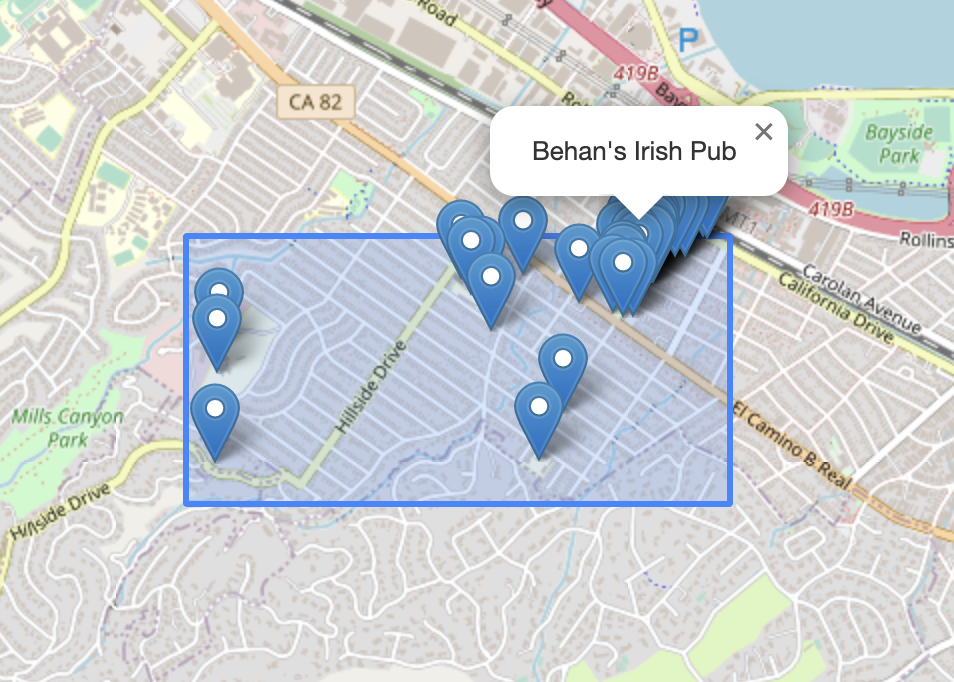
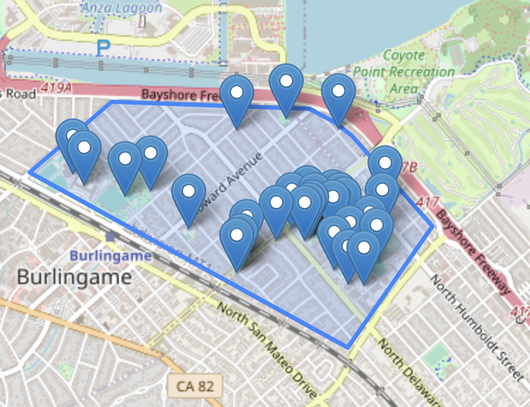
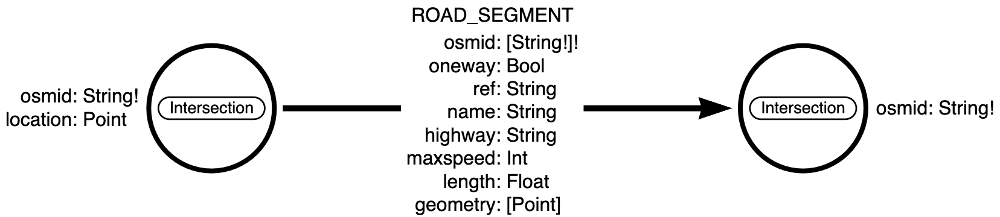
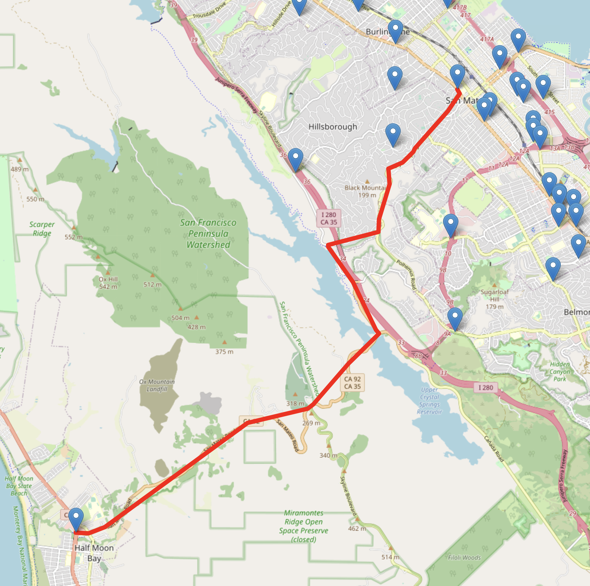
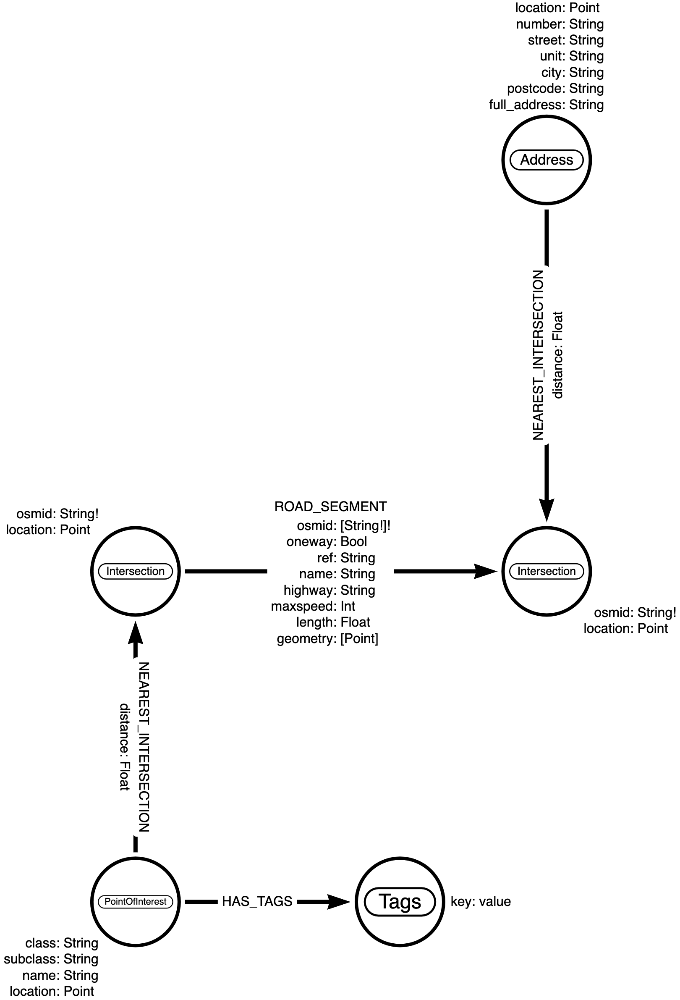
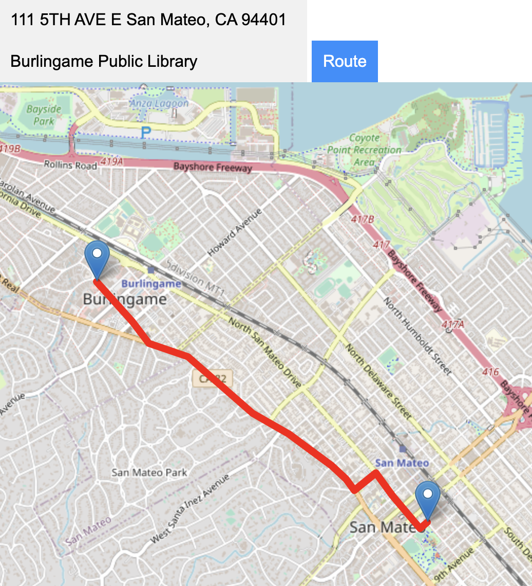

# Geospatial Graph Demos

Map-based demos to showcase geospatial functionality in Neo4j.

* Spatial search
    * Radius distance search
    * Bouding box search
    * Point in polygon search
    * Line geometries
* Routing
    * Airport routing (`gds.shortestPath.Dijkstra`)
    * OpenStreetMap road network routing (`apoc.algo.dijkstra` and `apoc.algo.aStar`)

## Spatial Search With Neo4j


See [`src/index.html`](src/index.html)

These examples use points of interest from the **Daylight Earth Table OpenStreetMap** distribution. [This Python notebook](https://github.com/johnymontana/daylight-earth-graph/blob/main/POI_import.ipynb) has the code to import this data into Neo4j.

[](https://github.com/johnymontana/daylight-earth-graph/blob/main/POI_import.ipynb)


### Radius Distance Search

```Cypher
WITH point({latitude: $latitude, longitude:$longitude}) AS radiusCenter
MATCH (p:Point)-[:HAS_GEOMETRY]-(poi:PointOfInterest)-[:HAS_TAGS]->(t:Tags) 
    WHERE point.distance(p.location, radiusCenter) < $radius
RETURN p {  latitude: p.location.latitude, 
            longitude: p.location.longitude, 
            name: poi.name, 
            categories: labels(poi),
            tags: t{.*}
        } AS point
```



See [`src/index.html`](src/index.html)

### Bounding Box Search

```Cypher
MATCH (p:Point)-[:HAS_GEOMETRY]-(poi:PointOfInterest)-[:HAS_TAGS]->(t:Tags) 
    WHERE point.withinBBox(
        p.location, 
        point({longitude: $lowerLeftLon, latitude: $lowerLeftLat }), 
        point({longitude: $upperRightLon, latitude: $upperRightLat}))
RETURN p {  latitude: p.location.latitude, 
            longitude: p.location.longitude, 
            name: poi.name, 
            categories: labels(poi),
            tags: t{.*}
        } AS point
```



See [`src/index.html`](src/index.html)

### Point In Polygon Search

Index backed point in polygon search can be accomplished by first converting the polygon to a bounding box, using Cypher's `point.withinBBox` predicate function to find points within the bounding box (using database index), and then filtering the results on the client to the polygon bounds. Here, using Turf.js:

```JavaScript
const polygon = layer.toGeoJSON();
var bbox = turf.bbox(polygon); // convert polygon to bounding box

// Within Bounding Box Cypher query
const cypher = `
    MATCH (p:Point)-[:HAS_GEOMETRY]-(poi:PointOfInterest)-[:HAS_TAGS]->(t:Tags) 
    WHERE point.withinBBox(
        p.location, 
        point({longitude: $lowerLeftLon, latitude: $lowerLeftLat }), 
        point({longitude: $upperRightLon, latitude: $upperRightLat}))
    RETURN p { latitude: p.location.latitude, 
               longitude: p.location.longitude, 
               name: poi.name, 
               categories: labels(poi),
               tags: t{.*}
            } AS point
          `;

var session = driver.session({
    database: "osmpois",
    defaultAccessMode: neo4j.session.READ,
});

session
    .run(cypher, {
        lowerLeftLat: bbox[1],
        lowerLeftLon: bbox[0],
        upperRightLat: bbox[3],
        upperRightLon: bbox[2],
    })
    .then((result) => {
        const bboxpois = [];
        result.records.forEach((record) => {
            const poi = record.get("point");
            var point = [poi.longitude, poi.latitude];
            bboxpois.push(point);
        });
        // filter results of bouding box query to polygon bounds
        const poisWithin = turf.pointsWithinPolygon(
            turf.points(bboxpois),
            polygon
        );

        poisWithin.features.forEach((e) => {
            L.marker([
                e.geometry.coordinates[1],
                e.geometry.coordinates[0],
            ])
            .addTo(map)
            .bindPopup("Polygon");
        })
```



See [`src/index.html`](src/index.html)

### Line Geometry Search


See [`src/strava.html`](src/strava.html)


Working with Line geometries in Neo4j using Strava data. To import data, first export user data from Strava then to add activities:

```Cypher
// Create Activity Nodes
LOAD CSV WITH HEADERS FROM "file:///activities.csv" AS row
MERGE (a:Activity {activity_id: row.`Activity ID`})
SET a.filename = row.Filename,
    a.activity_type = row.`Activity Type`,
    a.distance = toFloat(row.Distance),
    a.activity_name = row.`Activity Name`,
    a.activity_data = row.`Activity Date`,
    a.activity_description = row.`Activity Description`,
    a.max_grade = toFloat(row.`Max Grade`),
    a.elevation_high = toFloat(row.`Elevation High`),
    a.elevation_loss = toFloat(row.`Elevation Loss`),
    a.elevation_gain = toFloat(row.`Elevation Gain`),
    a.elevation_low = toFloat(row.`Elevation Low`),
    a.moving_time = toFloat(row.`Moving Time`),
    a.max_speed = toFloat(row.`Max Speed`),
    a.avg_grade = toFloat(row.`Average Grade`)

// Parse geojson geometries and create Geometry:Line nodes
MATCH (a:Activity) 
WITH a WHERE a.filename IS NOT NULL AND a.filename CONTAINS ".gpx"
MERGE (n:Geometry {geom_id:a.activity_id })
MERGE (n)<-[:HAS_FEATURE]-(a)
WITH n,a
CALL apoc.load.json('file:///' + replace(a.filename, '.gpx', '.geojson')) YIELD value
UNWIND value.features[0].geometry.coordinates AS coord
WITH n, collect(point({latitude: coord[1], longitude: coord[0]})) AS coords
SET n.coordinates = coords
SET n:Line
```

Radius distance search using line geometry and `any` Cypher list predicate function:

```Cypher
WITH point({latitude: $latitude, longitude: $longitude}) AS radiusCenter
MATCH (g:Geometry) 
    WHERE any(
        p IN g.coordinates WHERE point.distance(p, radiusCenter) < $radius
    )
RETURN [n IN g.coordinates | [n.latitude, n.longitude]] AS route
```

## Routing

### Airport Routing

Using the [Graph Data Science Neo4j Sandbox](https://dev.neo4j.com/sandbox) dataset.


See [`src/airports.html`](src/airports.html)

Airport routing using `gds.shortestPath.Dijkstra`:

```Cypher
MATCH (source:Airport {iata: $from}), (target:Airport {iata: $to})
CALL gds.shortestPath.dijkstra.stream('routes-weighted', {
    sourceNode: source,
    targetNode: target,
    relationshipWeightProperty: 'distance'
}) YIELD path
RETURN [n IN nodes(path) | [n.location.latitude, n.location.longitude]] AS route
```

### OpenStreetMap Road Network Routing



See [OSMnx Neo4j Experiments repo](https://github.com/johnymontana/neo4j-osmnx-experiments) for dataset.

```Cypher
MATCH (source:Intersection {osmid: $from}), (target:Intersection {osmid: $to})
CALL apoc.algo.dijkstra(source, target, 'ROAD_SEGMENT', 'length')
YIELD path, weight
RETURN [n in nodes(path) | [n.location.latitude, n.location.longitude]] AS route
```



See [`src/osm_routing.html`](src/osm_routing.html)



To enable searching for points of interest and addresses a full text index can be used:

```Cypher
CREATE FULLTEXT INDEX search_index IF NOT EXISTS FOR (p:PointOfInterest|Address) ON EACH [p.name, p.full_address] 
```

```
CALL db.index.fulltext.queryNodes("search_index", $searchString) 
YIELD node, score
RETURN coalesce(node.name, node.full_address) AS value, score, labels(node)[0] AS label, node.id AS id
ORDER BY score DESC LIMIT 25
```


```Cypher
MATCH (to {id: $dest})-[:NEAREST_INTERSECTION]->(source:Intersection) 
MATCH (from {id: $source})-[:NEAREST_INTERSECTION]->(target:Intersection)
CALL apoc.algo.dijkstra(source, target, 'ROAD_SEGMENT', 'length')
YIELD path, weight
RETURN [n in nodes(path) | [n.location.latitude, n.location.longitude]] AS route
```



See `src/address_routing.png`.

## Resources

* ["Making Sense Of Geospatial Data With Knowledge Graphs"](https://www.youtube.com/watch?v=-fs8ozxKklQ) Presented at NODES2022. November 2022. ([Slides](https://dev.neo4j.com/geo-nodes2022))